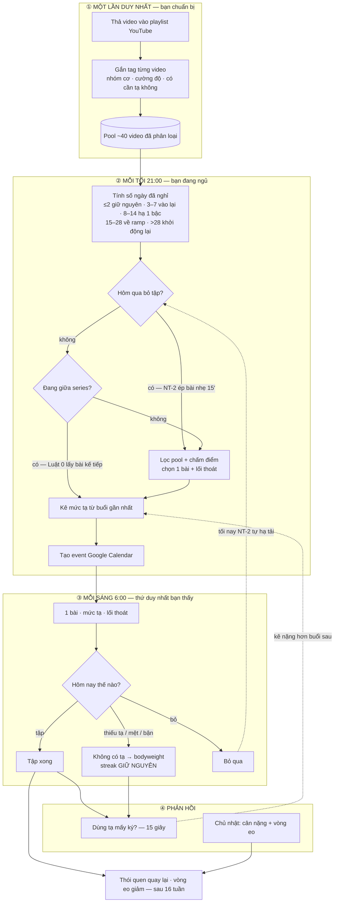
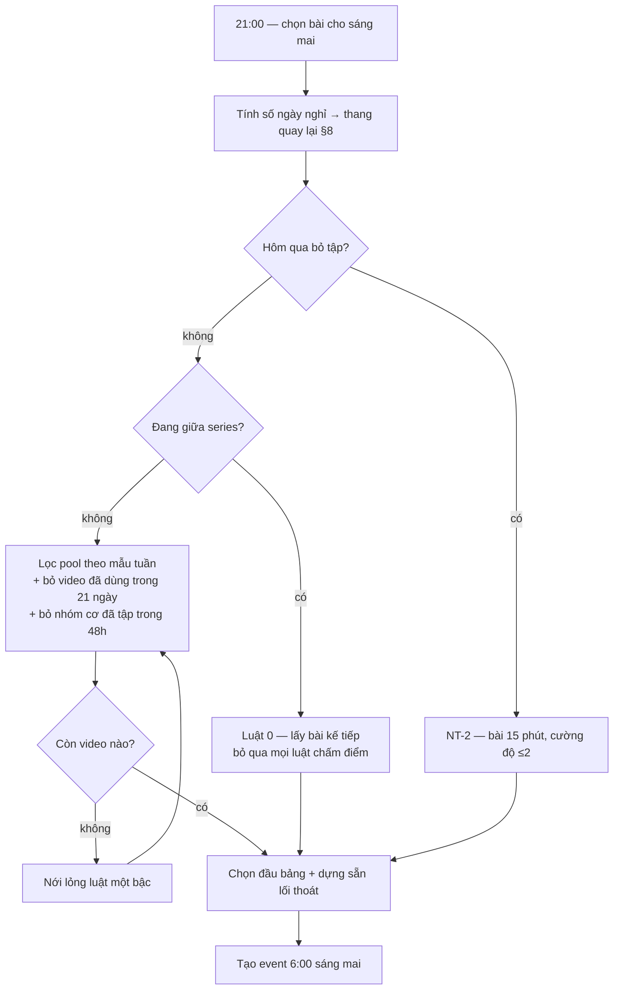

# MusMemo — đặc tả

Bản 0.3 · 25/09/2026 · một người dùng
Bản trang web (cùng nội dung): https://claude.ai/artifact/Du8y4sRy5o1aHGRa3yS9TS

Mọi mục đều đánh số để trích dẫn được trong code, commit và thảo luận.
Lý do đằng sau các lựa chọn nằm ở [decisions.md](decisions.md).

---

## §0 Tóm tắt

Bạn bỏ vào **một playlist YouTube** gồm những video bạn thích, và nói cho hệ
thống biết mấy giờ bạn tập, có bao nhiêu tạ, mỗi buổi rảnh bao lâu.

Mỗi tối 21:00, hệ thống chọn **đúng một bài cho sáng mai** và đẩy vào Google
Calendar, kèm mức tạ cụ thể. Sáng dậy mở lịch, bấm link, tập. Không phải nghĩ gì.

Sau buổi tập, 15 giây cho biết đã dùng tạ mấy ký. Hệ thống dùng đúng thông tin
đó để **kê nặng hơn cho buổi sau** — và nếu bạn bỏ tập, nó tự hạ tải để bạn
không đứt chuỗi.

### Toàn cảnh



**Hai mũi tên đứt nét là toàn bộ trí thông minh của hệ thống.** Bỏ chúng đi thì
đây chỉ còn là một cái máy phát lịch.

---

## §1 Thứ bạn thấy lúc 6 giờ sáng

```
THỨ TƯ · 06:00 – 06:32        Ngày 6/14    🔥 5 ngày liên tiếp

Thân dưới — Hip thrust & RDL
Caroline Girvan · 32 phút · cường độ 3/5
▶ youtu.be/xxxxxxxxxxx

Mức tạ hôm nay
  Hip thrust   20 kg  — Hai buổi liền ở 18 kg, thử 20 kg
  RDL          16 kg  — Mới đổi mức tuần trước, ở lại thêm một buổi

Không hợp hôm nay?
  Không có tạ → No Equipment Lower Body
  Nhẹ hơn 15′ → Chair Legs
  Chạy thay   → Easy Run 20min
```

Mặc định là **mở link và tập**. Các lối thoát là van xả cho ngày mệt, ngày bận,
ngày không có tạ — trạng thái mặc định là *hành động*, không phải *quyết định*.

"Ngày 6/14": giai đoạn đầu được đóng gói thành thử thách 14 ngày có ngày kết
thúc rõ ràng, thay vì một cái máy chạy vô tận. Hết 14 ngày mở tiếp block 30 ngày.

---

## §2 Năm nguyên tắc

Mọi quyết định kỹ thuật đều quy về một trong năm điều này.

| | |
|---|---|
| **NT-1** | **Mặc định là hành động, không phải quyết định.** Một lựa chọn đặt sẵn, kèm lối thoát. Menu ba món ngang hàng vẫn bắt phải nghĩ |
| **NT-2** | **Không bao giờ để trống hai ngày liên tiếp.** Hôm qua bỏ tập → hôm nay tự hạ xuống bài 15 phút cường độ ≤2, không hỏi |
| **NT-3** | **Không so sánh với phiên bản cũ của bạn.** Không PR cũ, không cự ly cũ. Mốc 0 là ngày khởi động lại |
| **NT-4** | **Tải trọng do hệ thống điều khiển, video chỉ dạy động tác.** Video tuần 12 giống hệt tuần 1 — bản thân nó không có tăng tải |
| **NT-5** | **Hai tuần đầu khóa trần, kể cả khi bạn đòi nặng hơn.** Gân và dây chằng thích nghi chậm hơn cơ rất nhiều |

---

## §3 Kiến trúc

```
Playlist YouTube → Ingest → SQLite → Scheduler → Google Calendar
   (bạn thêm)   (API+LLM)          (21:00)      (event 06:00)
                                       ↑              │
                                       └──────────────┘
                     phản hồi: đã tập · bỏ · lý do đổi · mức tạ
```

| Khối | Việc |
|---|---|
| **Ingest** | Chạy tay khi thêm video. YouTube Data API lấy metadata, Claude gắn nhóm cơ/cường độ/dụng cụ/series. Mỗi video gọi LLM **một lần** rồi lưu vĩnh viễn |
| **Scheduler** | 21:00 mỗi tối. Áp §5 lên pool, chọn một bài + lối thoát, ghi `sessions` trạng thái `planned` |
| **Publisher** | Tạo event Calendar 06:00 hôm sau, mô tả chứa link, mức tạ, lối thoát |
| **Collector** | 12:00 hôm sau. Đọc lại event, suy ra trạng thái, ghi `sessions` + `lifts` |

Chạy trên GitHub Actions. Không server. Trạng thái trong `data/musmemo.db`,
commit ngược vào repo sau mỗi lần chạy.

---

## §4 Dữ liệu

Mọi bảng có `user_id` ngay từ đầu dù chỉ một người dùng — hedge gần như miễn phí,
và là thứ quyết định sau này mở rộng được hay phải viết lại.

**users** — `gio_tap`, `ngan_sach_phut` (json theo thứ), `tran_cuong_do` (1–5),
`tuan_bat_dau` (mốc 0, NT-3), `block_het_han`

**videos** — `youtube_id` (chỉ lưu link, **không tải video**), `nhom_co`
(`lower·upper·full·core·cardio·mobility`), `cuong_do` 1–5, `dung_cu`
(`none·dumbbell`), `thoi_luong_giay`, `series_id`/`series_order`/`series_ten`,
`nguon` (`manual·discovered`), `con_song`

**sessions** — `ngay`, `trang_thai` (`planned·done·skipped·swapped`), `ly_do_doi`
(`no_weights·too_hard·no_time·not_feeling` — **dữ liệu quý nhất trong DB**),
`video_id` (video thực sự đã tập), `gcal_event_id`

**lifts** — `bai_tap` (`squat·hip_thrust·rdl·press·row·lunge`), `kg` (theo *bài
tập*, không theo video — mấu chốt của NT-4), `reps`, `qua_nang`

**video_exercises** *(v1.1, chưa dùng)* — `video_id`, `bai_tap`, `thu_tu`

**checkins** — `tuan`, `can_nang`, `vong_eo` (cm, ngang rốn — **thước đo chính**),
`an_uong` (1–3)

---

## §5 Thuật toán chọn bài

Chạy 21:00 cho ngày hôm sau. **Thứ tự chính là ưu tiên.**



**Luật 0 — khóa series.** Nếu buổi gần nhất thuộc series chưa xong, bài kế tiếp
được chọn cứng, bỏ qua mọi luật chấm điểm. *Chỉ NT-2 mới ghi đè được.* Và trần
cường độ NT-5 chặn cả Luật 0 — xem [QĐ-08](decisions.md).

1. Xác định loại buổi theo mẫu tuần §8
2. Kiểm tra NT-2 — hôm qua `skipped` thì ghi đè toàn bộ
3. Lọc pool: đúng nhóm cơ · `con_song` · `cuong_do ≤ tran_cuong_do` · dụng cụ
   phù hợp (ngày cardio/giãn cơ mặc định tìm `none`)
4. Loại video đã dùng trong **21 ngày**
5. Loại nhóm cơ đã tập trong **48 giờ** (trừ `core`, `mobility`)
6. Chấm điểm: nhóm cơ lâu nhất chưa chạm tới + thời lượng gần ngân sách + kênh ít bị đổi
7. Dựng sẵn lối thoát: cùng nhóm cơ nhưng không tạ · bài 15 phút nhẹ · một buổi chạy.
   **Lối thoát trùng bài chính thì bị lọc bỏ**
8. Nới lỏng dần nếu rỗng: bỏ luật 5 → hạ luật 4 xuống 10 ngày → nhóm cơ lân cận →
   cho phép lặp lại. **Không bao giờ trả rỗng im lặng** — ghi lại đã nới cái gì

> **Ràng buộc pool:** cần ~**40 video**, tối thiểu **3 video bodyweight mỗi nhóm cơ**,
> và **3 video nhẹ** (cường độ ≤2, ≤20 phút) để NT-2 và lối thoát "nhẹ hơn" dùng
> được. `ingest.py` tự cảnh báo khi thiếu.

---

## §6 Tăng tải và trần 30 kg

Theo dõi kg theo **bài tập**, không theo video.

**Luật tăng:** hai buổi liên tiếp cùng mức mà không báo "quá nặng" → tăng
**+2 kg** thân dưới, **+1 kg** thân trên. Báo quá nặng → giữ nguyên thêm hai buổi.

**Trần 30 kg là tổng cả bộ** (≈15 kg mỗi tay). Thân dưới sẽ chạm trần khoảng
tuần 6–8. Khi đó không thêm ký nữa mà leo bậc:

| Bậc | Cách | |
|---|---|---|
| 1 | Thêm ký | cho tới khi `kg ≥ 30 − bước nhảy` |
| 2 | Đơn phương | Bulgarian split squat, RDL một chân — một chân chịu toàn bộ tải |
| 3 | Tempo | hạ chậm 3 giây, dừng 2 giây ở đáy |
| 4 | Tăng rep, rút nghỉ | 8→12 rep, nghỉ 90→60 giây |

*Hiện tại kê tải theo nhóm cơ* (thân dưới → squat/hip thrust/RDL, thân trên →
đẩy vai/chèo) vì chưa biết video có động tác gì. v1.1 sẽ lấy từ chapters trong
mô tả video → bảng `video_exercises`.

---

## §7 Vòng phản hồi

Mọi tín hiệu quan trọng phải thu được mà người dùng gần như không phải làm gì.
Hệ thống nào bắt ghi nhật ký đều chết trong hai tuần.

| Tín hiệu | Cách thu | Phải làm gì |
|---|---|---|
| Có tập không | Đọc lại event qua Calendar API | **Không gì cả** |
| Lý do đổi bài | Lối thoát trong event | Một chạm, chỉ khi cần |
| Mức tạ | Form ngắn sau buổi | ~15 giây |
| Cơ thể | Check-in chủ nhật: cân nặng, vòng eo | 1 phút/tuần |

**`swapped` ≠ `skipped`.** Bấm "không có tạ" → streak giữ nguyên, NT-2 không kích
hoạt, không ghi `lifts` để khỏi nhiễu đường tăng tải.

---

## §8 Tuần mẫu, lộ trình, thang quay lại

| T2 | T3 | T4 | T5 | T6 | T7 | CN |
|---|---|---|---|---|---|---|
| Thân dưới 32′ | Chạy 22′ | Thân trên + core | Giãn cơ 15′ | Full body + core | Chạy dài | Nghỉ + check-in |

Ba buổi tạ, mỗi nhóm cơ chạm hai lần/tuần. **Core gắn đuôi vào buổi tạ**, không
làm buổi riêng — tập bụng để cơ dày lên, không để đốt mỡ bụng (đốt mỡ khu trú
không có thật). **Ngày chạy không đặt mục tiêu cự ly hay pace trong 6 tuần đầu**
(NT-3).

### Lộ trình 16 tuần

| Giai đoạn | Trần | Ngân sách | Mục tiêu thật |
|---|---|---|---|
| Tuần 1–2 | 3/5 khóa cứng | 20–25′ | **Thử thách 14 ngày.** Chỉ cần có mặt đúng giờ |
| Tuần 3–6 | 4/5 | 30–35′ | Tăng tải đều. Giai đoạn nhảy vọt |
| Tuần 7–12 | 5/5 | 30–40′ | Tăng tải là trọng tâm. Chạm trần 30 kg, Bậc 2 kích hoạt |
| Tuần 13–16 | 5/5 | 30–40′ | Giữ tải. **Vòng eo** là thước đo chính, không phải cân nặng |

### Thang quay lại

| Nghỉ | Hệ thống làm gì | Vì sao |
|---|---|---|
| ≤ 2 ngày | Tiếp tục bình thường | Chưa mất gì |
| 3–7 ngày | Bỏ qua phần thiếu, vào lại mức cũ | Thể lực gần như còn nguyên |
| 8–14 ngày | Hạ trần 1 bậc, làm lại block hiện tại | Bắt đầu mất nền |
| 15–28 ngày | Về giai đoạn ramp tuần 1–2 | Gân dây chằng đã lùi — nguy cơ chấn thương thật |
| > 28 ngày | Reset `tuan_bat_dau` | Và **không một lời nào nhắc lần trước** (NT-3) |

> **Về mục tiêu cơ bụng.** Cơ bụng lộ ra là chuyện tỷ lệ mỡ, không phải chuyện
> tập bụng, và 70–80% phần giảm mỡ do ăn uống quyết định — một hệ thống chỉ xếp
> lịch tập, dù hoàn hảo, không đủ. Mốc thời gian khả thi hay không **phụ thuộc
> hoàn toàn vào điểm xuất phát**; ngưỡng cụ thể và kỳ vọng của người dùng nằm ở
> `PROFILE.local.md`, không nằm trong repo. Vòng eo quan trọng hơn cân nặng vì
> khi recomposition, cân có thể đứng yên trong lúc eo nhỏ đi.

---

## §9 Phạm vi MVP

**Làm:** `ingest` · `schedule` · `publish` · `collect` · `digest` · `health`,
một file SQLite, ba workflow GitHub Actions.

**Cố tình không làm:** web UI hay app mobile (Calendar đã là giao diện) · đăng
nhập (hệ một người dùng) · đếm calo (sẽ bỏ sau hai tuần) · wearable/HRV (thêm
phụ thuộc thiết bị, mà ưu tiên là thói quen) · trình phát video trong app ·
timer đọc thành tiếng · bảng xếp hạng (trái NT-3) · tự tìm video mới (chưa đủ
dữ liệu) · tải video về máy (vi phạm ToS).

---

## §10 Rủi ro

- **Pool quá nhỏ** — rủi ro số một, và nằm ở phía người dùng chứ không phải code.
  Dưới 40 video thì luật 4 và 5 liên tục nới lỏng, lịch bắt đầu lặp.
- **Video chết giữa chừng** — 6 giờ sáng mở link thấy "Video unavailable" là bỏ
  tập luôn. `health.py` tồn tại chỉ vì điều này.
- **Luật quá chặt thành cứng nhắc** — một ngày gợi ý sai mà không có đường thoát
  thì mất niềm tin vào cả hệ thống. Lối thoát là bảo hiểm, đừng bỏ cho gọn.
- **Nợ nhóm cơ theo tuần** *(v1.1)* — bỏ buổi thứ Hai thì thân dưới lặng lẽ mất
  một lần chạm trong tuần. Cần theo dõi nợ và bù cuối tuần.
- **Mở rộng nhiều người dùng** — phần khó không ở DB mà ở **OAuth Google và vòng
  đời refresh token**, nặng hơn cả scheduler.
- **Tự tìm video mới** — cần ≥3 tháng dữ liệu thật. Bước rẻ nhất: nhân bản kênh
  ít bị bấm "đổi bài" nhất.

---

## §11 Điểm cần chốt

| # | Câu hỏi | Trạng thái |
|---|---|---|
| 01 | 30 kg mỗi tay hay cả bộ? | ✅ **Tổng cả bộ** (≈15 kg mỗi tay) |
| 02 | Điểm xuất phát — cân nặng và vòng eo? | ⬜ **Quan trọng nhất.** Trả lời ghi vào `PROFILE.local.md` |
| 03 | Giờ tập cố định? | ✅ Cố định, đặt ở `MUSMEMO_GIO_TAP`; lệch giờ thì kéo event |
| 04 | Form nhập tạ: ngay sau buổi hay gộp vào tối? | ⬜ |
| 05 | Ngày nghỉ cố định chủ nhật hay linh hoạt? | ⬜ |
| 06 | Chạy bộ: hệ thống kê hay để tự do? | ⬜ Nếu tự do thì thu tín hiệu "có tập không" thế nào? |
| 07 | Tên sản phẩm | ⬜ Repo là `musmemo`; spec này còn gọi "Sáng Mai". Đồng bộ hay giữ hai tên? |

---

## §12 Bối cảnh thị trường

Khảo sát 09/2026. Ý tưởng này đã tồn tại ở dạng **từng mảnh rời**, chưa ai ghép.

| Sản phẩm | Làm được | Thiếu |
|---|---|---|
| **LOOPS** (free) | Playlist YouTube → thử thách 7/21/30 ngày, có streak. Gần ý tưởng gốc nhất | Không thuật toán · không nhắc nhở · không theo dõi tạ · không thích ứng khi bỏ tập |
| **Prept** | AI xem video, bóc ra bài tập/set/rep. Log mức tạ từng set | Không tự quyết hôm nay tập gì · không Calendar |
| **MyFitnessPlan** (OSS) | Self-hosted, playlist → thư viện có tag | Lập lịch thủ công · không nhắc nhở · không tăng tải |
| **O'Coach** (free) | Nhận video YouTube, có scheduler + reminder | Không có thuật toán chọn bài theo hồi phục |
| **Fitbod · BodBot** | Tự sinh buổi tập từ lịch sử; bỏ buổi thì cân lại split | **Không dùng được pool YouTube của bạn** |
| **Stryd** | Day Gap với ngưỡng theo nghiên cứu | Chỉ cho chạy bộ. *Đã bê logic này vào §8* |
| **CGX** (~100 USD/năm) | 21 chương trình có cấu trúc, có calendar, đúng cho tạ đôi tại nhà | Không dùng pool của bạn · không có nút "hôm nay không có tạ" |

**Năm thứ không sản phẩm nào có:** pool của bạn + thuật toán hồi phục · Calendar
làm giao diện · nút "hôm nay không có tạ" không phá streak · giữ thói quen ưu
tiên hơn giữ chương trình · tăng tải trên nền video follow-along.
